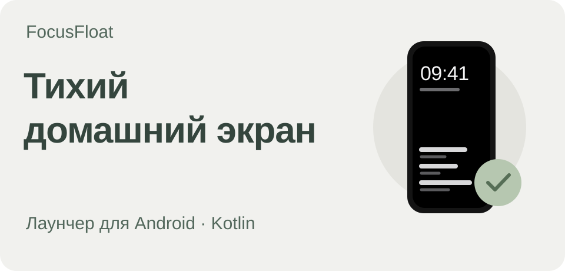
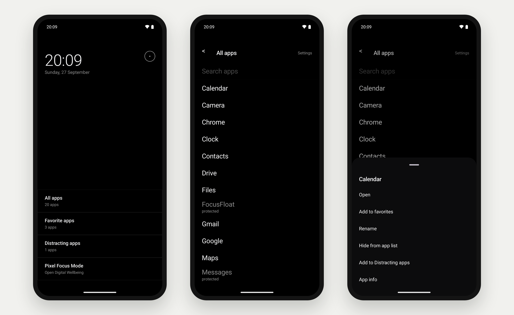

# FocusFloat

[English](README.md) | **Русский**

Минималистичный лаунчер для Android. Он заменяет стандартный домашний экран на спокойный, почти чёрно-белый: часы, дата и текстовые списки приложений без ярких иконок. Сделан под Google Pixel 7 и работает полностью локально.

**[Скачать APK](https://github.com/Zireael-web/focus-float/releases/latest)** · **[Интерактивный прототип](https://zireael-web.github.io/focus-float/design/FocusFloat.html)**



Мой pet-проект для собственного телефона: здесь пробую нативную разработку под Android на Kotlin и Jetpack Compose.

[Возможности](#возможности) · [Приватность](#приватность) · [Сборка](#сборка-из-исходников) · [Структура](#структура-проекта) · [Дизайн](#дизайн)

**Kotlin · Jetpack Compose · Room · DataStore · WorkManager · Android 8.0+**

## Возможности

- Домашний экран с часами, датой и индикатором заряда. Ниже — текстовые ссылки: все приложения, избранные, отвлекающие и режим фокусировки Pixel.
- AMOLED-чёрная тема по умолчанию. Цвет используется только для ошибок.
- Список всех приложений с поиском. Приложение можно добавить в избранное, переименовать, скрыть из списка, отметить как отвлекающее или открыть его системную страницу.
- Отвлекающие приложения: перед запуском нужно ввести слово `confirmed`. Это не блокировка, а осознанная пауза перед открытием.
- Защита внешних запусков: необязательная служба специальных возможностей показывает тот же экран подтверждения, если отвлекающее приложение открывают в обход лаунчера — например, из уведомления.
- Быстрый переход в режим фокусировки Pixel (Digital Wellbeing).
- Мастер первоначальной настройки: помогает назначить FocusFloat домашним экраном.

## Приватность

FocusFloat не ходит в сеть: в манифесте нет разрешения `INTERNET`, а `ACCESS_NETWORK_STATE`, которое добавляют зависимости, явно удалено. Нет аккаунтов, аналитики и серверной части. Избранное, переименования, списки и настройки хранятся на устройстве в Room и DataStore.

Службы специальных возможностей по умолчанию выключены и включаются вручную в настройках Android. Служба защиты внешних запусков не читает содержимое окон: она только узнаёт, какое приложение открылось. Экспериментальная служба автоматизации режима фокусировки предназначена для экранов Digital Wellbeing.

## Требования

- Android 8.0 (API 26) или новее. Режим фокусировки завязан на Digital Wellbeing от Google, поэтому эта часть рассчитана на Pixel.
- JDK 17 и Android SDK с платформой 36 — например, из Android Studio. Нужную версию Gradle скачает wrapper.

## Сборка из исходников

В корне репозитория выполните:

```sh
./gradlew assembleDebug
```

APK появится в `app/build/outputs/apk/debug/`. Установка на подключённый телефон:

```sh
./gradlew installDebug
```

После установки нажмите «Домой» и выберите FocusFloat, или пройдите мастер настройки в самом приложении.

Юнит-тесты:

```sh
./gradlew testDebugUnitTest
```

### Сборка `internal` со своей подписью

Скопируйте `keystore.properties.example` в `keystore.properties` и укажите путь к хранилищу ключей, алиас и пароли. Вместо файла можно задать переменные окружения `FOCUSFLOAT_INTERNAL_*`. Затем выполните `./gradlew assembleInternal`. Файлы `keystore.properties` и `keystores/` в Git не попадают.

## Структура проекта

```text
FocusFloat/
├── app/src/main/java/com/focusfloat/app/
│   ├── ui/                Экраны на Compose и MainViewModel
│   ├── design/            Тема и базовые компоненты (токены из docs/design)
│   ├── launcher/          Список приложений через LauncherApps, избранное, переименование, скрытие
│   ├── distracting/       Подтверждение запуска и служба защиты внешних запусков
│   ├── digitalwellbeing/  Переход в режим фокусировки Pixel и его автоматизация
│   ├── pause/             Ранний механизм паузы приложений до полуночи через Shizuku
│   ├── settings/, data/   DataStore и база Room
│   └── core/              Модели и работа со временем
├── app/src/test/          Юнит-тесты
└── docs/                  Дизайн и заметки для проверки на устройстве
```

## Дизайн

В `docs/design/` лежат дизайн-токены (`TOKENS.md`), описание компонентов (`COMPONENTS.md`) и интерактивный макет примерно 45 экранов (`FocusFloat.html`). Макет отражает исходную концепцию: пауза категорий приложений через Shizuku в текущей версии заменена переходом в режим фокусировки Pixel. **[Открыть интерактивный прототип](https://zireael-web.github.io/focus-float/design/FocusFloat.html)**. Локально макет открывается через статический сервер, например `python3 -m http.server` в папке `docs/design`.

Что стоит перепроверить на реальном устройстве, собрано в [`docs/spikes.md`](docs/spikes.md).

## Лицензия

[MIT](LICENSE)
